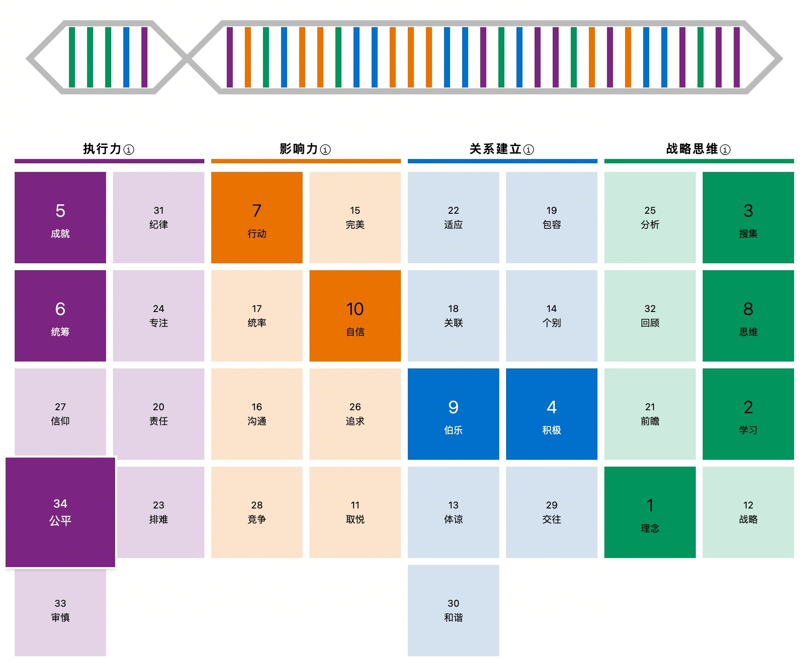
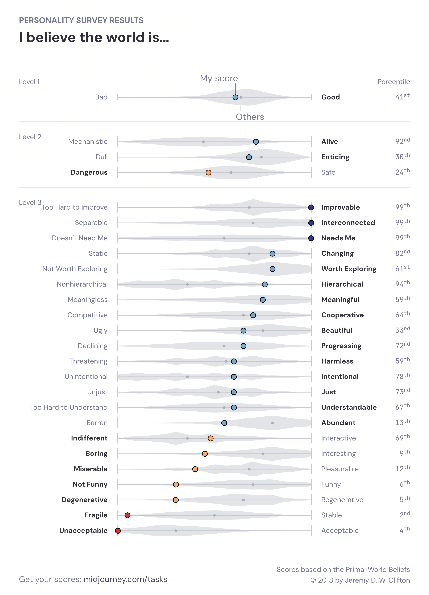

## Hi, I'm Dongzhe Zhu (朱东哲) 👋

**AI Product Manager × Builder**

Currently at **ByteDance**, building the Creative AGENT for [Jimeng AI](https://jimeng.jianying.com) from 0→1, now the main entry of Jimeng Web. Also defining VLM-powered Smart Video at Jianying.

Previously shipped LLM-powered data products at **Tencent**, winning the 2023 Business Breakthrough Award.

- 在字节做过成熟的 agent 产品 — 即梦 Creative AGENT 是 Lovart / Oiioii 的通用版，踩过 agent 产研的所有坑
- 热情和好奇心充沛的人
- 用 GitHub repo 当 PRD 写，Claude Max 20 倍总量消耗者，用 AI 武装自己和团队
- Vibe coding 真正做出完整产品并上线的人

---

### 💼 Experience

**ByteDance — AI Product Manager** · Jianying & Jimeng · Shenzhen · 2024.07 - Present
- Owner of Jimeng Creative AGENT: 0→1 product build, now the main entry of Jimeng Web
- Led AGENT post-training: RL for creative model, automated SFT pipeline with biweekly A/B iterations
- Defined VLM training for Jianying Smart Video: end-to-end effect spec, data pipeline, eval system
- Exploring **即梦创作 Studio**: full-pipeline AI video automation for creators (script → voiceover → music → final video), modular Skills architecture on Claude Code

**Tencent — Product Specialist / Data PM** · Overseas Publishing · Shenzhen & London · 2022.03 - 2024.07
- Rebuilt game sentiment monitoring with LLM — multi-language, multi-timezone, fully automated → **2023 Business Breakthrough Award**
- Built ChatBI: AI-native data product with LLM + RAG, transforming how teams query game analytics
- Owned DataBrain sentiment product: real-time alerts, periodic reports; significantly grew PV/UV
- Built DataLab from 0→1: visual analytics platform enabling no-SQL data analysis for operations teams

### 🎓 Education

**Nanyang Technological University** · M.Sc. Computer Control & Automation · GPA 4.6/5, Top 10%
**Tongji University** · B.Eng. Automation

---

🔗 [View all repositories →](https://github.com/BENZEMA216?tab=repositories)

### 🧬 Personality Profile

<b>CliftonStrengths Top 10</b> — 战略思维主导型

&nbsp;

My Top 5 signature themes are all about **ideation, learning, and turning insights into action**.

| Rank | Strength | Domain |
|:----:|----------|--------|
| 1 | **理念** Ideation | 🟢 Strategic Thinking |
| 2 | **学习** Learner | 🟢 Strategic Thinking |
| 3 | **搜集** Input | 🟢 Strategic Thinking |
| 4 | **积极** Positivity | 🔵 Relationship Building |
| 5 | **成就** Achiever | 🟣 Executing |
| 6 | **统筹** Arranger | 🟣 Executing |
| 7 | **行动** Activator | 🟠 Influencing |
| 8 | **思维** Intellection | 🟢 Strategic Thinking |
| 9 | **伯乐** Developer | 🔵 Relationship Building |
| 10 | **自信** Self-Assurance | 🟠 Influencing |

**Domain distribution:** 🟢 Strategic Thinking ×4 · 🟣 Executing ×2 · 🟠 Influencing ×2 · 🔵 Relationship Building ×2

> 我的核心驱动力：对新理念的好奇 → 大量吸收信息 → 形成独特洞察 → 快速付诸行动

📎 Original result

 

<b>Primal World Beliefs</b> — "I believe the world is..."

&nbsp;

Based on the Primal World Beliefs framework by Jeremy D. W. Clifton.

**Level 1:** Bad ↔ **Good** — 41st percentile

**Level 2:**

| Spectrum | Leaning | Percentile |
|----------|---------|:----------:|
| Mechanistic ↔ Alive | **Alive** | 92nd |
| Dull ↔ Enticing | Dull | 30th |
| Dangerous ↔ Safe | Dangerous | 24th |

**Level 3 — Standout beliefs:**

| Extreme high (≥90th) | | Extreme low (≤10th) | |
|---|:---:|---|:---:|
| **Improvable** | 99th | **Fragile** (not Stable) | 2nd |
| **Interconnected** | 99th | **Unacceptable** (not Acceptable) | 4th |
| **Needs Me** | 99th | **Degenerative** (not Regenerative) | 5th |
| **Hierarchical** | 94th | **Not Funny** (not Funny) | 6th |
| **Alive** | 92nd | **Boring** (not Interesting) | 9th |

**All 22 sub-beliefs (Level 3):**

| # | Negative pole | Positive pole | Percentile |
|:---:|---|---|:---:|
| 1 | Too Hard to Improve | **Improvable** | **99th** |
| 2 | Separable | **Interconnected** | **99th** |
| 3 | Doesn't Need Me | **Needs Me** | **99th** |
| 4 | Nonhierarchical | **Hierarchical** | **94th** |
| 5 | Mechanistic | **Alive** | **92nd** |
| 6 | Static | **Changing** | 82nd |
| 7 | Unintentional | **Intentional** | 78th |
| 8 | Unjust | **Just** | 73rd |
| 9 | Declining | **Progressing** | 72nd |
| 10 | Indifferent | Interactive | 69th |
| 11 | Too Hard to Understand | Understandable | 67th |
| 12 | Competitive | Cooperative | 64th |
| 13 | Not Worth Exploring | Worth Exploring | 61st |
| 14 | Meaningless | Meaningful | 59th |
| 15 | Threatening | Harmless | 59th |
| 16 | Bad | Good | 41st |
| 17 | Ugly | Beautiful | 33rd |
| 18 | Dull | Enticing | 30th |
| 19 | Dangerous | Safe | 24th |
| 20 | Barren | Abundant | 13th |
| 21 | Miserable | Pleasurable | 12th |
| 22 | **Boring** | Interesting | **9th** |
| 23 | **Not Funny** | Funny | **6th** |
| 24 | **Degenerative** | Regenerative | **5th** |
| 25 | **Unacceptable** | Acceptable | **4th** |
| 26 | **Fragile** | Stable | **2nd** |

> 世界是活的、互联的、可以改善的、需要我的 —— 但也是脆弱的、退化的、不可接受的。
> 一个改革者的世界观：看到深层缺陷，但坚信改变的可能性和必要性。

📎 Original result

 

<b>200+ Personality Measures</b> — Revised NEO PI-R Big Five

&nbsp;

A comprehensive assessment based on the **Revised NEO Personality Inventory** (scores range 0–50). Covers the Big Five traits and 30 facets.

**Top traits (99th percentile):** Experience-Seeking, Tough-Mindedness, Resourcefulness, Ambitious, Disorderliness

**Big Five Overview:**

| Trait | Score | Percentile | Bar |
|-------|:-----:|:----------:|-----|
| **Extraversion** 外向 | 39/50 | **89th** High | `██████████████████░░░░` |
| **Conscientiousness** 责任心 | 31/50 | **72nd** Above Avg | `██████████████░░░░░░░░` |
| **Openness** 开放性 | 37/50 | **60th** Above Avg | `████████████░░░░░░░░░░` |
| **Agreeableness** 宜人性 | ~32/50 | **~10th** Low | `██░░░░░░░░░░░░░░░░░░░░` |
| **Neuroticism** 神经质 | very low | **2nd** Very Low | `░░░░░░░░░░░░░░░░░░░░░░` |

**Extraversion 外向 — 89th percentile (High)**
> Highly assertive, energetic, and positive. The strongest Big Five dimension.

| Facet | Approx. Percentile |
|-------|:------------------:|
| Positive Emotions 积极的情绪 | ~93rd |
| Gregariousness 合群 | ~83rd |
| Excitement-Seeking 寻求刺激 | ~77th |
| Warmth 温暖 | ~67th |
| Activity 活动 | ~57th |

**Conscientiousness 责任心 — 72nd percentile (Above Average)**
> Achievement-driven and dutiful, but deliberately flexible — very low orderliness and deliberation.

| Facet | Approx. Percentile |
|-------|:------------------:|
| Achievement-Striving 达成-努力 | ~85th |
| Dutifulness 尽职尽责 | ~85th |
| Competence 能力 | ~74th |
| Self-Discipline 自律 | ~65th |
| Deliberation 审议 | ~32nd ↓ |
| Order 次序 | ~15th ↓ |

**Openness 开放性 — 60th percentile (Above Average)**
> Open to new experiences and liberal values, but practical rather than fantasy-driven.

| Facet | Approx. Percentile |
|-------|:------------------:|
| Values 值 | ~85th |
| Actions 行动 | ~70th |
| Feelings 感情 | ~67th |
| Ideas 想法 | ~50th |
| Aesthetics 美学 | ~36th |
| Fantasy 幻想 | Low ↓ |

**Agreeableness 宜人性 — ~10th percentile (Low)**
> Independent-minded and direct. High trust, but very low compliance and tender-mindedness.

| Facet | Approx. Percentile |
|-------|:------------------:|
| Trust 信任 | ~77th |
| Altruism 利他 | ~35th |
| Compliance 合规 | ~23rd ↓ |
| Tender-Mindedness 温柔 | Very Low ↓ |
| Attention-Seeking | High ↑ |

**Neuroticism 神经质 — 2nd percentile (Very Low)**
> Extremely emotionally stable. Lower than 98% of people. Rock-solid under pressure.

| Facet | Approx. Percentile |
|-------|:------------------:|
| Angry Hostility 愤怒 | ~33rd |
| Anxiety 焦虑 | ~14th |
| Self-Consciousness 自我意识 | ~12th |
| Low Mood 情绪低落 | ~5th |
| Vulnerability 脆弱 | ~5th |

**Cross-test consistency:**
> Extraversion 89th ↔ CliftonStrengths Positivity #4, Activator #7
> Tough-Mindedness 99th ↔ Low Agreeableness 10th + Low Neuroticism 2nd
> Disorderliness 99th ↔ Low Order 15th in Conscientiousness
> Low Deliberation 32nd ↔ CliftonStrengths Activator #7 (acts fast, thinks later)
> Low Neuroticism 2nd ↔ CliftonStrengths Self-Assurance #10

📎 Original result

 

### 🗺️ Memory Map

> GitHub as my external brain — organized by projects, layered by temperature.
>
> 📖 [Memory System 维护指南](./MEMORY-GUIDE.md) — 热/温/冷分层、项目结构、日常操作流程

<b>即梦创作 Studio</b> — 字节跳动即梦 AI 创作工具链

&nbsp;

| Repo | Role |
|------|------|
| [Dremaina-AGENT-2026](https://github.com/BENZEMA216/Dremaina-AGENT-2026) | 主项目 |
| [music-analyzer](https://github.com/BENZEMA216/music-analyzer) | 技能：音频 → Dreamina Prompt |
| [creative-think](https://github.com/BENZEMA216/creative-think) | 技能：Brief → 创意推理链 |
| [dreamina-claude-skills](https://github.com/BENZEMA216/dreamina-claude-skills) | 技能集 |

<b>OpenClaw 生态</b> — AI Agent Gateway 部署与产品

&nbsp;

| Repo | Role |
|------|------|
| [xian-home](https://github.com/BENZEMA216/xian-home) | 弦的信号空间 (Web) |
| [HomForClawd](https://github.com/BENZEMA216/HomForClawd) | iOS 客户端 |
| [Creative-Cowork](https://github.com/BENZEMA216/Creative-Cowork) | 协作平台 |
| [openclaw-pitfalls](https://github.com/BENZEMA216/openclaw-pitfalls) | 技能：部署经验库 |
| [agent-observability-tools](https://github.com/BENZEMA216/agent-observability-tools) | 观测工具 |

<b>Agent Identity</b> — 让 AI Agent 拥有自主视觉表达

&nbsp;

| Repo | Role |
|------|------|
| [agent-form](https://github.com/BENZEMA216/agent-form) | agentavatar.dev + AVI 协议 |
| [agent-identity-docs](https://github.com/BENZEMA216/agent-identity-docs) | 产品思考文档 |

<b>creo</b> — 品牌美学记忆平台

&nbsp;

| Repo | Role |
|------|------|
| [creo](https://github.com/BENZEMA216/creo) | 品牌档案 + Visual DNA + 资产索引 |

<b>独立项目 & 通用技能</b>

&nbsp;

| Repo | Role |
|------|------|
| [tradingcoach](https://github.com/BENZEMA216/tradingcoach) | AI 交易复盘分析平台 |
| [chatshot](https://github.com/BENZEMA216/chatshot) | AI 对话截图（跨平台） |
| [self-purify](https://github.com/BENZEMA216/self-purify) | Claude Code 安全审计 |
| [rss-reader](https://github.com/BENZEMA216/rss-reader) | 信息输入管道 |

### 📫 Contact

- Email: BENZEMAZDZ99@gmail.com
- GitHub: [@BENZEMA216](https://github.com/BENZEMA216)

---

🌐 [benzema216.github.io](https://benzema216.github.io)
